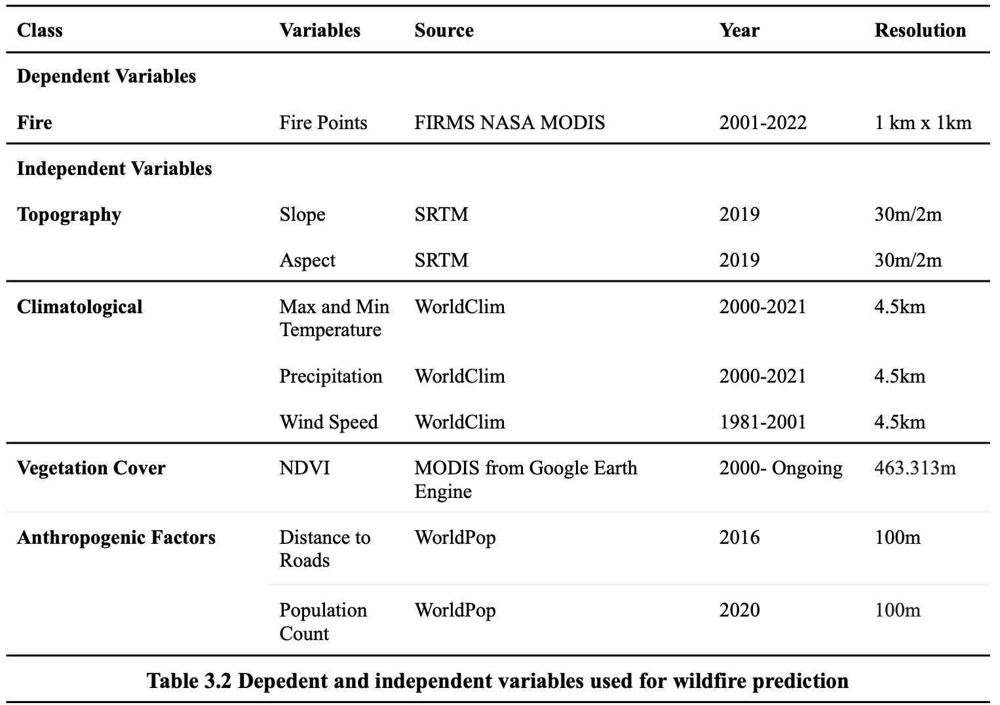

# Wildfire Risk and Social Vulnerability in the UK </a>

<!-- badges: start -->

[](https://www.repostatus.org/#active)

<!-- badges: end -->

The `wildfires` package provides easy access to data on the intersection
between social vulnerability and wildfire risk for the UK's nations:

-   England: Middle Layer Super Output Area (MSOA)
-   Wales: MSOA
-   Scotland: Intermediate Zones
-   Northern Ireland: Super Data Zones

This package is based on Hasan Guler's thesis "Spatial Assessment of
Wildfire Vulnerability in England and Wales: Coupling Social
Vulnerability with Predicted Wildfire Susceptibility," aiming to
spatially assess wildfire vulnerability in England and Wales by coupling
social and biophysical vulnerability.

The impact of wildfire widely vary based on the resilience of exposed
communities, influenced by the time and location of the incident in
conjunction with socioeconomic variables. It is therefore necessary to
gain a deeper understanding of how socioeconomic disparities intersect
with environmental hazards, to enable targeted interventions and
informed decision-making in measures to decrease hazard exposure.

## Installation

Install the development version from [GitHub](https://github.com/) with:

``` r
# install.packages("devtools")
devtools::install_github("humaniverse/wildfires")
```

## Usage and Key Datasets

The package provides a comprehensive toolkit for analyzing social
vulnerability and wildfire risks, including:

-   Calculation of the Social Vulnerability Index (SoVI) using PCA.
-   Wildfire risk prediction using Random Forest models.
-   Combined datasets highlighting areas at high risk due to both social
    vulnerability and wildfire susceptibility.

### Social Vulnerability Index (SoVI)

-   England: `wildfires::sovi_england`
-   Wales: `wildfires::sovi_wales`
-   Nothern Ireland: `wildfires::sovi_ni`
-   Scotland: `wildfires::sovi_scotland`

**Indicators of social vulnerability**, which have been used to create
the SoVI are also available for all UK nations.

-   England & Wales: `wildfires::indic_msoa_eng_wales`
-   Nothern Ireland: `wildfires::indic_sdz_ni`
-   Scotland: `wildfires::indic_msoa_scotland`

### Wildfire Risk (Summer)

-   England: `wildfires::wildfire_risk_england`
-   Wales: `wildfires::wildfire_risk_wales`
-   Nothern Ireland: `wildfires::wildfire_risk_ni`
-   Scotland: `wildfires::wildfire_risk_scotland`

## Methodology

### Creation of the Social Vulnerability Index via Principal Component Analysis

The datasets including indicators of social vulnerability at the MSOA
level or equivalent for all UK nations were standardised using z-score
normalization to ensure comparability. Then, correlation among the
variables was assessed to ensure the suitability of PCA. The
Kaiser-Meyer-Olkin (KMO) measure and Bartlett's test were applied, with
high KMO scores and significant Bartlett's test p-values, justifying the
PCA approach for all nations.

PCA was conducted using the `psych` package's `principal` function with
varimax rotation to enhance interpretability. Five components were
extracted based on eigenvalues, representing the underlying structure of
the data. The variance explained by each component was calculated, and
factor loadings were examined to understand the variable contributions.

The factor loadings shed light on the dimensions of variation within the
data:

-   **Factor 1**: Represents urban vulnerability, highlighted by housing
    conditions and ethnic compositions.
-   **Factor 2**: Captures socio-economic and health-related
    vulnerabilities, particularly around disability and education
    levels.
-   **Factor 3**: Emphasizes linguistic and ethnic diversity, alongside
    housing conditions.
-   **Factor 4**: Reflects geographic mobility and housing market
    dynamics, indicating areas with high internal migration and private
    rental activity.
-   **Factor 5**: Distinguishes demographic structures, particularly the
    balance between younger and older populations.

Finally, the Social Vulnerability Index (SoVI) was calculated as a
weighted sum of the component scores, with weights based on the variance
explained by each component. The SoVI scores were then standardized
within country.

### Prediction of Summer Wildfire Risk via Random Forest

**Data Collection**

Spatial data on fire occurrences (dependent variable) and various
independent variables was collected from a variety of sources.
Independent variables were categorized into topographical,
climatological, vegetation cover, and anthropogenic factors.



**Preprocessing and Data Preparation**

Independent variables were organized into raster stacks for both spring and summer
seasons, and standardised using z-score normalization.

Pseudo-background points, serving as absence data, was generated in a
quantity equal to that of the recorded fire points for the season. These points 
were randomly distributed across the UK within the country's boundaries.

**Model Training and Validation**

Two random forest models were trained on a subset of the data - one for summer
data, the other for spring.

**Performance Metrics & Feature Importance**

Using another subset of the data, the models' performances were assessed using 
a confusion matrix from which accuracy, precision, recall, and F1 score were 
derived.

The significance of each independent variable in predicting wildfires
was also evaluated through feature importance analysis, identifying the most
influential factors for fire occurrence.

**Wildfire Risk Index Creation**

Utilizing the trained Random Forest model, probabilities of wildfire occurrences were
predicted across the UK. They were then aggregated to the MSOA level, resulting 
in the Wildfire Risk Index. Missing values were imputed using higher geography averages when necessary.
Similarly to the Social Vulnerability Index, the Wildfire Risk Index was standardized separately for England, Wales, Scotland, and Northern Ireland to enable comparison within each nation.

*Note: As of now, only summer wildfires were predicted, using the summer random forest model*

## Getting help

If you encounter a clear bug, please file an issue with a minimal
reproducible example on
[GitHub](https://github.com/humaniverse/wildfires/issues).

------------------------------------------------------------------------

Please note that this project is released with a [Contributor Code of
Conduct](https://www.contributor-covenant.org/version/2/0/code_of_conduct/).
By participating in this project you agree to abide by its terms.
